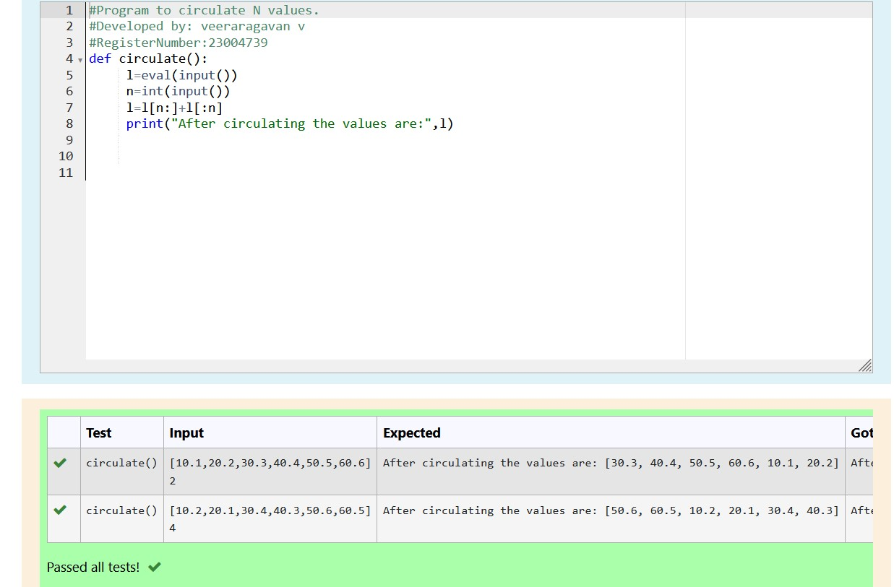

# Circulate-the-values-of-N-variables
## Aim:
To write a python program to circulate the n variables using function concept
## Equipment’s required:
PC
Anaconda - Python 3.7
## Algorithm: 
### Step 1: 
get a git repositary
### Step 2: 
Assign the function command in the program
### Step 3: 
Get the value from the user for the number of rotation
### Step 4: 
Using the slicing concept rotate the list
### Step 5: 
Print both the values it would be circulate
### Step 6:
End the program 
## Program:
```
#Program to circulate N values.
#Developed by: veeraragavan v
#RegisterNumber:23004739
def circulate():
     l=eval(input())
     n=int(input())
     l=l[n:]+l[:n]
     print("After circulating the values are:",l)
```
## Output:



## Result:
Thus the circulate N values are successfully executed